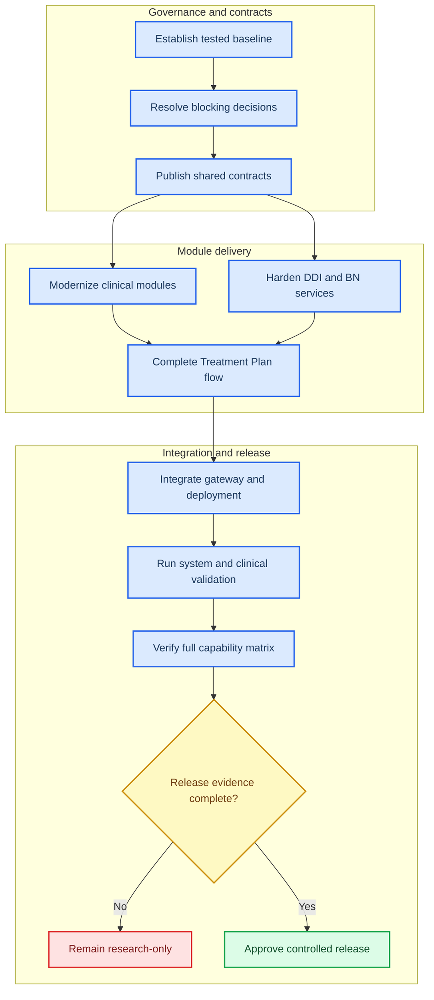

# INSIGHT application completion plan

_Evidence-based, dependency-ordered implementation roadmap prepared from `context/`, `Modules/`, and `BNs/` on 2026-07-28._

---

## 🎯 Destination and planning rules

Destination: deliver the INSIGHT psychiatrist-facing schizophrenia clinical decision-support application defined in `context/project-overview.md`, while preserving module independence, REST-only integration, canonical UUID identity, explicit uncertainty, psychiatrist authority, immutable final plans, PHI controls, and fail-closed clinical/model release gates.

This plan is not a clinical-release claim. Treatment Plan governance currently says `BLOCKED FOR CLINICAL RELEASE`, all eight decision gates are unresolved, accountable owners are unnamed, clinical validation has not been executed, and no approvals are recorded.

Every issue below is one work packet for one implementation session. Each packet must:

- start with `git status --short` in the affected nested repository and preserve pre-existing changes;
- read the named module contract, adapter, schema, handoff, and focused tests;
- update the authoritative contract before changing a public interface;
- implement one bounded vertical slice, including migrations, API/domain behavior, UI behavior when applicable, and tests;
- run focused tests, the owning module's full suite, and affected provider/consumer contract tests;
- update `context/progress-tracker.md` with commands, results, remaining risks, and next work;
- create one informative commit in each affected nested repository;
- avoid editing protected clinical sources, model files, applied migrations, runtime data, or generated `graphify-out/` artifacts by hand.

Issue types:

- `AFK`: implementable without a live product or clinical decision.
- `HITL`: requires an attributable human decision, review, approval, or source handoff. An agent must not supply the human side.
- `Conditional`: enters the active roadmap only if an approved scope decision includes that capability or model.

No issue may invent clinical data, probabilities, utilities, terminology mappings, approvals, stakeholder identities, patient fixtures, or source citations.

### Definition of fully functioning

Following this roadmap yields a fully functioning app only when all conditions below are true:

- INS-066 classifies every normative goal, feature, user-flow step, success criterion, and required operational capability as required for v1 or explicitly excluded by an attributable HITL scope decision.
- Every required capability maps to an implemented owning issue and executable proof. Placeholder routes, synthetic production UI data, browser-local clinical authority, production mock auth, and unapproved models or knowledge artifacts do not count as implementation.
- Psychiatrist initial-assessment and follow-up journeys and administrator account, knowledge, log, and backup journeys pass through the gateway on a clean install and after restore.
- Standalone module suites, REST contracts, migrations, security/privacy checks, accessibility checks, failure modes, and deployment/rollback checks pass for one recorded build and exact policy, model, and knowledge hashes.
- Technical completion and authorization for clinical deployment are separate gates. A technically complete research build must retain its research-only controls; controlled clinical deployment additionally requires INS-062 through INS-065.
- Any unresolved HITL decision blocks dependent capability rows. It cannot be treated as an implementation default or silently removed from scope.

Thus the plan is a complete route to the app under the approved v1 scope, not a substitute for clinical, privacy, regulatory, or release decisions.

### Coverage audit

| Required capability area | Owning implementation issues | Terminal proof |
| --- | --- | --- |
| Authentication, roles, disclaimer, session revocation, account administration | INS-003, INS-013, INS-067, INS-073 | INS-058, INS-061, INS-076 |
| Dashboard workspace, real module discovery, unavailable-module behavior | INS-002, INS-012, INS-067 | INS-057 through INS-059, INS-076 |
| Patient, alias, Encounter, lookup, and intake | INS-014, INS-021, INS-022 | INS-058, INS-059, INS-076 |
| Clinician-controlled Diagnosis | INS-015, INS-023, INS-024 | INS-057, INS-058, INS-076 |
| Server-authoritative PANSS Severity | INS-016, INS-025 through INS-027 | INS-057, INS-058, INS-076 |
| Medical History and approved suicide-risk assessment | INS-017, INS-028 through INS-030 | INS-057, INS-058, INS-076 |
| Follow-up Delta, longitudinal history, and immutable supersession | INS-004, INS-053, INS-059, INS-068, INS-069 | INS-059, INS-061, INS-076 |
| Medication identity, DDI, review, activation, and clinician resolution | INS-009, INS-018, INS-029, INS-031, INS-032, INS-070 | INS-058, INS-061, INS-076 |
| BN registry, governed models, evaluation, and administration | INS-007, INS-019, INS-033 through INS-047, INS-071 | INS-050, INS-058, INS-062 through INS-064, INS-076 |
| Treatment Plan snapshot, policy, recommendation, review, finalization, provenance | INS-020, INS-048 through INS-054, INS-072 | INS-058, INS-059, INS-061 through INS-064, INS-076 |
| Read-only AI assistant when required by approved v1 scope | INS-006, INS-055, INS-066 | INS-061, INS-076 |
| Admin knowledge, logs, backup, restore, migration, and rollback | INS-005, INS-032, INS-060, INS-071, INS-073 through INS-075 | INS-061, INS-065, INS-076 |
| Unified deployment, contract CI, security, privacy, accessibility, clinical validation, release mode | INS-056 through INS-065, INS-076 | INS-065 and recorded release evidence |

## 🔍 Evidence baseline

### Sources read

- All six normative files in `context/`, in required order.
- Functional module READMEs, handoffs, contracts, schemas, routes, and test inventories for Authentication, Dashboard, Add New Patient, Diagnosis, Severity, Medical History, DDI Checker, BN Manager, and Treatment Plan.
- BN topic READMEs/specifications and model-asset inventory under `BNs/`.
- SHA-256 comparison of model copies in `BNs/`, model-only module directories, and BN Manager's registry.

### Current-state facts

| Area | Repository evidence | Planning consequence |
| --- | --- | --- |
| Progress tracking | `context/progress-tracker.md` is still an empty template | INS-001 establishes a tested baseline before feature work |
| Authentication | v1 session returns integer `user_id`, no session UUID, and Unix `expires_at` | A versioned identity/session contract and migration are required |
| Dashboard | FastAPI workspace router exists; module links remain placeholders; mock auth is possible | Integrated routing must use real Authentication and gateway-relative module discovery |
| Patient/Encounter | Add New Patient stores Patient UUID and Intake UUID, but no canonical `encounterId` entity/contract | Encounter identity must be introduced without reusing `patientCode` or inferring from dates |
| Diagnosis | SQLite-backed and server-evaluated; local route key is patient code; canonical lookup is disabled by default | Add UUID/Encounter/Assessment APIs, migrate storage, then remove code-keyed integration |
| Severity | Patient-code-keyed Express API, JSON persistence, browser scoring, open CORS, recent codes in `localStorage`, no auth/CSRF | Replace prototype trust, identity, persistence, and browser-storage behavior |
| Medical History | Six-character activation code and JSON files; no production auth, CSRF, DB, concurrency, or audit | Introduce canonical assessment identity and hardened persistence/API behavior |
| Suicide risk | No standalone Follow-up or structured C-SSRS service exists in `Modules/`; only clozapine-suicide model assets exist | Ownership and approved source must be decided before implementation |
| DDI | Deterministic engine and validation tests exist; admin review, activation, and audit remain browser-local; no protected server REST service | Build server-owned KB lifecycle and clinical check API |
| BN Manager | Four XML models are registered as `active`; their docs identify qualitative, neutral, compact, or placeholder probabilities | Registry lifecycle must distinguish structural availability from clinical approval |
| BN assets | Canonical four registry XML files exactly duplicate `BNs/` copies; several non-runtime `.net` packages also duplicate model-only module folders | Establish one governed source/registry path and prevent silent divergence |
| Treatment Plan | Core backend seams and TP-01 through TP-22 tests exist; UI uses synthetic data; OpenAPI routes for contract/schema discovery, recommendation runs, and supersession are not all wired | Connect real upstream contracts, workflow routes, and UI before integrated use |
| Deployment | Treatment Plan has module-specific release assets; no root unified multi-process image/gateway for all modules was found | Build and verify the target unified deployment without merging module boundaries |
| Working trees | Most functional module repos are clean; Severity has untracked `graphify-out/`; Treatment Plan has extensive pre-existing modified/untracked work | Every packet must re-check status and avoid overwriting concurrent user work |

Test-pass claims in module handoffs were not re-run while authoring this plan. INS-001 owns reproducible baseline execution.

## 🧭 Dependency map

## 📋 Phase 0 — baseline and binding decisions

### INS-001 — Establish a reproducible repository baseline

- **Type / owner:** AFK / integration
- **Blocked by:** None
- **Build:** Record nested repo commit/status, runtime/dependency versions, module start commands, route inventories, migrations, current schema/contract versions, and test commands. Run each functional module's documented suite in isolated temp storage. Record failures/skips without fixing unrelated code.
- **Acceptance:** Baseline distinguishes committed code from dirty work; every functional module has a pass/fail/skip result; no runtime DB or fixture residue is tracked; `progress-tracker.md` names the first failing integration boundary.
- **Tests:** Existing full suites for all nine functional modules, each run from its owning worktree; `git status --short` before/after each suite; verify generated/runtime residue is absent.

### INS-002 — Decide gateway, process supervision, ports, and runtime matrix

- **Type / owner:** HITL / architecture and operations
- **Blocked by:** INS-001
- **Build:** Write an ADR selecting the internal gateway/router, in-container process supervisor, module port/base-path map, compatible Python and Node runtime matrix, health aggregation policy, and shutdown behavior. Preserve one process and one data directory per module.
- **Acceptance:** Decision names alternatives and trade-offs; only gateway is public; liveness/readiness remain per module; browser routes are relative; Windows Docker Desktop and Ubuntu VPS paths are covered.
- **Tests:** ADR schema/link check; static deployment-policy test rejects public module ports, duplicate ports, root execution, and missing health entries.

### INS-003 — Define internal service authentication and attribution

- **Type / owner:** HITL / security architecture
- **Blocked by:** INS-001
- **Build:** Version the contract for user-attributed internal REST calls and non-browser/background calls. Define allowed cookie forwarding, service identity, CSRF boundary, request/correlation/causation propagation, SSRF allowlists, revocation behavior, and audit separation.
- **Acceptance:** No module decodes Authentication JWTs or trusts request-body identity; background calls cannot impersonate a psychiatrist; finalization remains bound to a current user session; secrets and PHI are excluded from headers/logs.
- **Tests:** Contract examples for browser, server-to-server, revoked session, disabled account, role change, background job, and untrusted destination.

### INS-004 — Decide Follow-up, Encounter, and structured suicide-risk ownership

- **Type / owner:** HITL / product, clinical, architecture
- **Blocked by:** INS-001
- **Build:** Resolve whether Follow-up is a standalone owner or an orchestration flow, which module owns Encounter and Follow-up Delta, and which module owns structured C-SSRS assessment data. Obtain the approved C-SSRS source/licensing contract before defining questions or scoring.
- **Acceptance:** Context map names one writer for every entity; Add New Patient remains Patient/Encounter owner unless explicitly changed; no risk score or question is inferred from model summaries; missing risk data has explicit fail-closed behavior.
- **Tests:** Ownership-registry test rejects duplicate writers; schema examples cover initial encounter, follow-up encounter, unknown risk, unavailable assessment, and supersession.

### INS-005 — Decide administration, logs, backup, and restore ownership

- **Type / owner:** HITL / architecture, security, operations
- **Blocked by:** INS-001
- **Build:** Define how Dashboard routes to account administration, security audit, clinical provenance, operational logs, per-module backup, aggregate backup manifests, restore verification, and retention. Do not move domain data into Dashboard.
- **Acceptance:** Authentication owns account/security-audit data; clinical provenance stays with owning clinical modules; backup artifacts name module/schema versions without exposing PHI in filenames; restore cannot cross-write another module's DB.
- **Tests:** Ownership/permission matrix; admin-versus-psychiatrist authorization tests; backup manifest schema and cross-module isolation tests.

### INS-006 — Decide AI assistant provider, data policy, and UI boundary

- **Type / owner:** HITL / privacy, security, product
- **Blocked by:** INS-001
- **Build:** Approve or reject v1 assistant scope; define provider, server-side structural identifier omission, defense-in-depth scrubbing, retention, encryption, access, deletion, backup, provider-use policy, page-context allowlist, and read-only tool boundary.
- **Acceptance:** Assistant cannot mutate, sign, approve, or finalize records; names/codes/MRNs/contact details/dates are excluded; a provider failure cannot block clinical workflows; unsupported policy keeps assistant disabled.
- **Tests:** Redaction corpus using synthetic identifiers; prompt/context schema tests; mutation-tool absence test; retention/authorization tests; disabled-provider UI state.

### INS-007 — Resolve model-source ownership and duplicate artifacts

- **Type / owner:** HITL / BN owner and clinical model owner
- **Blocked by:** INS-001
- **Build:** Create a model manifest mapping every `BNs/` topic, model-only `Modules/` copy, and BN Manager registry file to source status, canonical owner, format, hash, approval state, and allowed runtime use. Record exact-copy hashes already observed; decide how derivative copies are regenerated or retired.
- **Acceptance:** One runtime owner exists; duplicate copies cannot diverge silently; `.net` and non-registry XML assets remain non-runtime unless admitted through governance; protected source/model files are not modified in this packet.
- **Tests:** Manifest schema; hash reconciliation; duplicate stable-ID rejection; missing source/approval blocks runtime admission.

### INS-008 — Resolve intended use, jurisdiction, population, and diagnosis gates

- **Type / owner:** HITL / psychiatrist, product, regulatory
- **Blocked by:** INS-001
- **Build:** Resolve TP scope gates DG-01, DG-03, and DG-07 with evidence references: research-only status, deployment jurisdictions, supported diagnosis pathway, supported population, exclusions, and observable unsupported-case behavior.
- **Acceptance:** Decisions are non-empty and attributable; exclusions cover the populations named by TP-01; unsupported input cannot produce a plausible plan; regulatory re-review triggers are recorded.
- **Tests:** `scope-matrix.schema.json`; negative fixtures for excluded/unknown diagnosis and population; release gate remains blocked until all required gates/approvals exist.

### INS-009 — Resolve knowledge authority and terminology gates

- **Type / owner:** HITL / clinical, pharmacy, privacy, regulatory
- **Blocked by:** INS-001
- **Build:** Resolve DG-02 and DG-08: approved guideline editions, formularies, dose/contraindication/monitoring sources, licenses, diagnosis terminology, medication terminology, and update cadence.
- **Acceptance:** Every executable clinical rule/model/KB points to an approved controlled source; unavailable excerpts remain blocked; no `rxnorm-pending` identity is approved for clinical activation.
- **Tests:** Source-manifest schema; license/evidence-reference completeness; clinical activation rejects missing/unapproved source metadata.

### INS-010 — Resolve plan breadth, scheduling, emergency, and override gates

- **Type / owner:** HITL / psychiatrist, clinical safety, product
- **Blocked by:** INS-001
- **Build:** Resolve DG-04, DG-05, and DG-06: supported plan sections, appointment/availability/timezone ownership, emergency behavior, missing-data policy, contraindication/allergy/suicide-risk gates, high-severity DDI override policy, and non-pharmacological scope.
- **Acceptance:** Emergency behavior never implies an unimplemented emergency-services integration; hard and overridable blockers are distinct; required rationale and attribution are explicit; uncertainty behavior is testable.
- **Tests:** Scope-matrix validation; policy decision tables; emergency/missing/conflicting/high-DDI scenarios; finalization gate tests.

### INS-011 — Name accountable owners and complete regulatory evidence workflow

- **Type / owner:** HITL / project governance
- **Blocked by:** INS-008, INS-009, INS-010
- **Build:** Record named accountable owners, regulatory assessment, canonical scope-matrix hash, evidence references, and signature workflow. Keep protected minutes/signatures outside source control.
- **Acceptance:** All five required roles are named; signatures bind to exact canonical content; changing signed scope creates a new version; no approval is fabricated.
- **Tests:** TP-01 release-gate script against incomplete and structurally complete synthetic matrices; hash/signature binding test.

### INS-066 — Freeze the v1 capability matrix and completion contract

- **Type / owner:** HITL + AFK / product, clinical, architecture, quality
- **Blocked by:** INS-004 through INS-011
- **Build:** Create a versioned traceability matrix covering every goal, feature, core-flow step, in-scope statement, exclusion, and success criterion in project-overview.md. For each row record required, conditional, or approved-excluded status; owner; implementation issue; contract/schema; verification; evidence location; and release-mode applicability. Add any newly exposed work as one-session issues before freezing the matrix.
- **Acceptance:** Every normative capability has exactly one status and accountable owner; every required row maps to implementation and executable proof; exclusions are attributable scope decisions rather than missing code; conditional items cannot disappear silently; matrix hash is recorded for final acceptance.
- **Tests:** Matrix schema/lint; duplicate and orphan requirement detection; required-without-issue and required-without-test failures; exclusion-without-approval failure; project-overview heading/link coverage.

## 🌐 Phase 1 — versioned contracts and canonical identity

### INS-012 — Publish the common internal REST profile

- **Type / owner:** AFK / architecture
- **Blocked by:** INS-002, INS-003
- **Build:** Create canonical versioned schemas for problem details, health, readiness, contract discovery, UUIDs, UTC timestamps, `X-Schema-Version`, `X-Request-ID`, correlation/causation IDs, ETags, `If-Match`, and idempotency behavior. Define compatibility and deprecation rules.
- **Acceptance:** Every module can copy/package the artifacts unchanged; unsupported majors fail explicitly; errors exclude paths, stack traces, secrets, and PHI.
- **Tests:** Schema examples; OpenAPI lint; provider/consumer compatibility; invalid UUID/time/header/error fixtures.

### INS-013 — Upgrade Authentication to a versioned UUID session contract

- **Type / owner:** AFK / Authentication
- **Blocked by:** INS-003, INS-012
- **Build:** Publish a new session contract with stable user UUID, session UUID, canonical roles, UTC expiry, disclaimer and password gates, interface version, and compatibility mapping from current integer IDs. Add migrations without rewriting applied migrations.
- **Acceptance:** Downstream authorization needs no `message` parsing or JWT decoding; revocation/disable/role changes remain immediate; old clients have a time-bounded adapter; production rejects default credentials/secrets.
- **Tests:** Migration fresh/upgrade/rollback-plan tests; contract tests; login/session/revocation/role/disclaimer/password/CSRF/rate-limit tests; legacy adapter deprecation test.

### INS-014 — Publish Patient and Encounter v2 contracts

- **Type / owner:** AFK / Add New Patient
- **Blocked by:** INS-004, INS-012, INS-013
- **Build:** Define Patient, patient-code alias, Encounter, and intake snapshot resources with UUIDs, schema/resource versions, provenance, list/search pagination, idempotent creates, ETags, and exact lookup semantics. Define mapping from existing `intakeId` rows without inferring encounters from dates.
- **Acceptance:** `patientCode` is never a foreign key or integration URL key; Patient and Encounter have independent immutable UUIDs; patient plus first encounter creation is atomic; collisions fail closed.
- **Tests:** JSON Schema/OpenAPI; migration fixtures; alias collision; invalid UUID; changed idempotency payload; stale ETag; pagination; UTC validation.

### INS-015 — Publish Diagnosis assessment v2 contract

- **Type / owner:** AFK / Diagnosis
- **Blocked by:** INS-012, INS-013, INS-014
- **Build:** Define assessment UUID, Patient UUID, Encounter UUID, checked criteria, server evaluation, explicit clinician decision/bypass, rule/schema version, actor, status, timestamps, ETag, and audit/provenance representation. Keep legacy code routes as thin adapters only.
- **Acceptance:** Criteria result never becomes diagnosis automatically; bypass remains explicit; no patient alias appears in new URLs; Treatment Plan can fetch a versioned encounter-bound snapshot.
- **Tests:** Contract/live-route parity; authority cases; stale write; idempotent init; unknown patient/encounter; audit ordering; legacy adapter equivalence.

### INS-016 — Publish PANSS Severity assessment v2 contract and scoring rules

- **Type / owner:** AFK / Severity
- **Blocked by:** INS-012, INS-013, INS-014
- **Build:** Define 30 item inputs, allowed scores, assessment status, explicit pass/skip semantics, server-derived subscales/total, scale/rule version, Patient/Encounter/Assessment UUIDs, ETag, idempotency, and provenance. Do not add an interpretation threshold absent an approved source.
- **Acceptance:** Server rejects missing/out-of-range items and client/server total mismatch; passed assessment remains missing evidence, not zero/normal; Treatment Plan receives explicit completeness.
- **Tests:** Boundary scores; all 30 item codes; missing/duplicate/unknown item; derived-score mismatch; pass state; schema/version/ETag/idempotency cases.

### INS-017 — Publish Medical History assessment v2 contract

- **Type / owner:** AFK / Medical History
- **Blocked by:** INS-009, INS-012, INS-013, INS-014
- **Build:** Version current fields and controlled options; add Patient/Encounter/Assessment UUIDs, actor, timestamps, resource version, original medication text, optional normalized identity state, ETag, idempotency, and explicit unknown/not-assessed values where approved.
- **Acceptance:** UI defaults do not silently become negative clinical facts; conditional answers validate server-side; medication instances remain distinct; Treatment Plan can retrieve an encounter-bound snapshot.
- **Tests:** Current conditional rules; unknown/not-assessed fixtures; 20-medication boundary; repeated medication instances; stale write; schema/idempotency/auth cases.

### INS-018 — Publish DDI knowledge and clinical-check v1 contracts

- **Type / owner:** AFK / DDI
- **Blocked by:** INS-003, INS-009, INS-012
- **Build:** Define medication resolution, knowledge revision lifecycle, review/activation/rollback, pairwise check request/response, unresolved coverage, finding/audit/override, version/hash, medication-set hash, idempotency, role permissions, and errors. Align one endpoint with Treatment Plan.
- **Acceptance:** Only approved active records generate alerts; ambiguous/unknown medications never yield “no interactions”; every intended pair is reported; override does not mutate KB facts.
- **Tests:** Schema/OpenAPI; duplicate instances; ambiguous/unknown resolution; zero-approved activation; incomplete pairs; changed idempotency payload; rationale/role/CSRF cases.

### INS-019 — Publish BN evaluation and registry-governance v3 contract

- **Type / owner:** AFK / BN Manager
- **Blocked by:** INS-007, INS-009, INS-012
- **Build:** Standardize model discovery and evaluation around stable ID, semantic version, content hash, XSD/schema version, engine version, lifecycle/clinical-use status, target, accepted/ignored evidence, warnings, posterior, mapping version, evaluation UUID/time, and idempotency. Remove caller model text from clinical routes unless explicitly retained as admin validation only.
- **Acceptance:** Qualitative/placeholder models cannot appear clinically approved; arbitrary paths remain rejected; compact-row broadcast is visible metadata; Treatment Plan uses the same published route.
- **Tests:** Four registry models; XSD versus semantic failures; unknown evidence; invalid target/posterior; content hash stability; blocked clinical-use status; auth/CSRF/role/idempotency.

### INS-020 — Reconcile Treatment Plan OpenAPI with live routes

- **Type / owner:** AFK / Treatment Plan
- **Blocked by:** INS-012 through INS-019
- **Build:** Version the OpenAPI and schemas to reference real provider contracts and live security/idempotency/concurrency behavior. Remove undocumented route drift. Do not wire new behavior in this contract-only packet.
- **Acceptance:** Every live public route appears in OpenAPI; every OpenAPI operation has an implementation issue; response schemas match exact runtime envelopes; compatibility impact is documented.
- **Tests:** Existing TP-05 lint/compatibility checks plus live-router/OpenAPI parity and external-reference resolution.

## 🧩 Phase 2 — owning-module vertical slices

### INS-067 — Replace Dashboard placeholders with the real role-scoped workspace

- **Type / owner:** AFK / Dashboard
- **Blocked by:** INS-002, INS-003, INS-012, INS-013
- **Build:** Replace hard-coded placeholder module routes with a configured, versioned discovery registry that resolves gateway-relative module capabilities. Upgrade Dashboard to the Authentication UUID session contract, preserve disclaimer and password gates, disable production mock auth by default, and render available, unavailable, and unauthorized destinations explicitly without owning downstream data.
- **Acceptance:** Psychiatrist and admin buttons resolve only live authorized routes; disabled or failed modules remain visible with typed safe status; account changes and session revocation take effect immediately; Dashboard remains navigation-only; no localhost or patient alias enters browser navigation.
- **Tests:** Real Authentication provider/consumer contract; discovery success, unavailable, unsupported-version, and unauthorized cases; production mock-auth fail-closed test; role/disclaimer/revocation tests; browser navigation, no-PHI, keyboard, focus, and accessibility tests.

### INS-021 — Implement Patient and Encounter v2 persistence and APIs

- **Type / owner:** AFK / Add New Patient
- **Blocked by:** INS-013, INS-014
- **Build:** Add ordered migration and repository methods for Encounter; expose authenticated v2 create/read/list/search routes; add idempotency, ETag, problem details, request IDs, and compatibility mapping from existing intakes.
- **Acceptance:** Fresh and upgraded DBs preserve patients/intakes; atomic patient-plus-encounter create returns canonical UUIDs; no PHI is placed in URLs/logs; module runs standalone.
- **Tests:** Full module suite plus fresh/upgrade migration, transaction rollback, collision, pagination, idempotency, ETag, auth/CSRF, contract, and static-file denylist tests.

### INS-022 — Connect Add New Patient UI to Encounter v2

- **Type / owner:** AFK / Add New Patient
- **Blocked by:** INS-021
- **Build:** Use gateway-relative v2 APIs and host-supplied context; implement the documented intake steps without duplicating diagnosis/severity logic; remove alias-bearing navigation; preserve form state and visible async failure.
- **Acceptance:** Psychiatrist creates Patient and first Encounter; downstream steps receive UUID context; embedded mode owns no host chrome/history; keyboard/error/focus behavior follows UI context.
- **Tests:** Frontend unit/DOM tests; real HTTP UI-to-backend test; no-PHI URL/storage assertion; keyboard/focus/accessibility smoke.

### INS-023 — Migrate Diagnosis storage and routes to assessment UUIDs

- **Type / owner:** AFK / Diagnosis
- **Blocked by:** INS-015, INS-021
- **Build:** Add migration from code-keyed sessions to canonical references using an explicit resolver/quarantine path; implement v2 create/read/update/latest routes, ETags, idempotency, and versioned audit snapshots.
- **Acceptance:** No unresolved row is assigned a guessed Patient/Encounter UUID; legacy routes delegate to one evaluator; stale writes return precondition failure; criteria and clinician decision remain distinct.
- **Tests:** Full Diagnosis suite plus migration/quarantine, v2 contract, authority, concurrency, auth/CSRF, request-ID, and legacy-equivalence tests.

### INS-024 — Connect embedded Diagnosis UI to v2 assessment context

- **Type / owner:** AFK / Diagnosis
- **Blocked by:** INS-022, INS-023
- **Build:** Replace patient-code UI state with host-provided Patient/Encounter UUID context; retain mount/unmount; render server evaluation and explicit confirm/bypass actions; remove alias query strings.
- **Acceptance:** UI cannot confirm from computed `met` alone; bypass is attributable; failed persistence is visible; teardown removes listeners; no host navigation mutation.
- **Tests:** Existing embed suite plus v2 HTTP, no-PHI URL, keyboard/focus, server/client evaluation-equivalence, failure-state, and teardown tests.

### INS-025 — Implement server-authoritative PANSS evaluation

- **Type / owner:** AFK / Severity
- **Blocked by:** INS-016, INS-021
- **Build:** Introduce a pure server scoring/evaluation module and v2 routes; validate exact item set and recompute totals; return explicit incomplete/passed/completed states and version metadata.
- **Acceptance:** Browser totals are display projections only; invalid or mismatched totals fail; unknown/missing inputs remain explicit; legacy API, if retained, delegates to the same evaluator.
- **Tests:** Pure unit vectors for 30-item totals/subscales; malformed inputs; pass/incomplete behavior; v2 contract and legacy-equivalence tests.

### INS-026 — Replace Severity JSON with module-owned DB and security

- **Type / owner:** AFK / Severity
- **Blocked by:** INS-013, INS-025
- **Build:** Add repository seam, ordered SQLite migration/import, Patient/Encounter/Assessment UUID storage, versions, append-only provenance, ETag/idempotency, Authentication REST checks, CSRF, restricted CORS, readiness, and explicit corruption failure.
- **Acceptance:** Corrupt JSON never becomes an empty store; concurrent writes cannot lose updates; production mock/bypass is impossible; imported records without canonical identity are quarantined.
- **Tests:** Migration fresh/import/corrupt/quarantine; repository contract; auth/revocation/role/CSRF; ETag/idempotency; liveness/readiness; failure rollback.

### INS-027 — Rebuild Severity UI integration without PHI browser storage

- **Type / owner:** AFK / Severity
- **Blocked by:** INS-022, INS-026
- **Build:** Add bounded mount/unmount API, gateway-relative requests, host context, server result rendering, persistent visible urgent/error states, and remove patient codes from URLs and `localStorage`.
- **Acceptance:** 30 items remain keyboard operable; passed/completed are textually distinct; status is not color-only; reduced motion works; no hard-coded clinician name remains.
- **Tests:** UI component/DOM tests; browser-storage and URL scans; real HTTP completion/pass/error tests; keyboard, target-size, focus, semantics, contrast, and reduced-motion checks.

### INS-028 — Replace Medical History JSON with v2 repository and security

- **Type / owner:** AFK / Medical History
- **Blocked by:** INS-013, INS-017, INS-021
- **Build:** Add repository seam and ordered DB migrations/import; implement v2 create/read/latest routes, canonical IDs, ETag/idempotency, auth/CSRF, restricted CORS, readiness, versioned provenance, and explicit storage failure.
- **Acceptance:** Existing controlled-option and conditional validation remains authoritative; JSON corruption cannot erase visible state; old activation codes become compatibility aliases only; concurrent writes are protected.
- **Tests:** Existing suite plus fresh/import/corrupt/quarantine migration, repository, contract, auth/role/revocation/CSRF, ETag/idempotency, and readiness tests.

### INS-029 — Connect Medical History UI and medication-resolution feedback

- **Type / owner:** AFK / Medical History
- **Blocked by:** INS-017, INS-022, INS-028
- **Build:** Embed UI with host UUID context; preserve original medication instances and any server-supplied typed identity status without silently selecting candidates; remove activation-code navigation. Live DDI resolution remains owned by INS-031.
- **Acceptance:** Unresolved medication identity remains visible for later DDI review; form defaults are labeled as unanswered until submitted; failed save remains visible; no PHI enters URL/storage/logs.
- **Tests:** Conditional UI suite; duplicate and unresolved medication rows; no-PHI scan; auth/CSRF HTTP integration; keyboard/focus/error tests.

### INS-030 — Implement the approved structured suicide-risk module

- **Type / owner:** Conditional HITL + AFK / owner selected in INS-004
- **Blocked by:** INS-004, INS-008, approved source/licensing handoff, INS-012 through INS-014
- **Build:** Implement one source-backed assess-and-retrieve slice: publish its assessment contract, scaffold independent service/storage/UI, and implement only the approved minimum scoring/interpretation needed by that slice. Additional clinical rules require new issues.
- **Acceptance:** No question, score, threshold, or emergency instruction is invented; psychiatrist assertion remains explicit; urgent behavior follows INS-010; Treatment Plan can consume a versioned encounter snapshot.
- **Tests:** Source-to-field traceability; scoring golden cases supplied/approved by owner; missing/conflicting/urgent states; auth/CSRF/ETag/idempotency; accessibility and no-PHI tests.

### INS-068 — Publish the Follow-up Delta and longitudinal-history contract

- **Type / owner:** AFK / owner selected in INS-004
- **Blocked by:** INS-004, INS-012 through INS-014, INS-066
- **Build:** Define a versioned Follow-up Delta resource and retrieval contract tied to a new Encounter, prior Encounter, and prior Final Plan. Include actor, status, timestamps, resource version, source references, and explicit changed, unchanged, unknown, not-assessed, and unavailable states only where approved sources define the fields. Define patient history projection without transferring ownership of upstream records.
- **Acceptance:** No encounter is inferred from date or patient code; delta data has one writer; prior plans and upstream snapshots remain immutable; missing follow-up facts are not converted to no-change; Treatment Plan can retrieve a versioned, encounter-bound delta.
- **Tests:** Schema/OpenAPI; initial-without-prior, no-change, changed, unknown, unavailable, patient/encounter mismatch, stale ETag, idempotency, pagination, and unsupported-version fixtures.

### INS-069 — Implement Follow-up capture, history, and retrieval

- **Type / owner:** AFK / owner selected in INS-004
- **Blocked by:** INS-013, INS-014, INS-021, INS-068
- **Build:** Implement one bounded vertical slice from Dashboard launch through new Encounter selection, Follow-up Delta capture, module-owned persistence/API, longitudinal history projection, and Treatment Plan retrieval. Use gateway-relative URLs, current Authentication, CSRF, ETag, idempotency, explicit async failures, and standalone module execution.
- **Acceptance:** Psychiatrist can start a follow-up for the selected Patient and new Encounter, review prior plan context, save explicit delta states, and reopen the record; no prior record is mutated; failed or partial saves never appear complete; unsupported fields stay unavailable rather than guessed.
- **Tests:** Fresh/upgrade migration; repository and contract tests; initial/no-prior, no-change, changed medication, new risk, missing data, retry, stale write, auth/revocation/CSRF, browser accessibility/no-PHI, restart, and standalone tests.

## 🧠 Phase 3 — DDI and BN decision services

### INS-031 — Build server-owned DDI clinical-check API

- **Type / owner:** AFK / DDI
- **Blocked by:** INS-018
- **Build:** Wrap the existing deterministic engine in an independently runnable authenticated service; add module-owned repository/migrations for immutable KB revisions, checks, findings, resolution coverage, overrides, and audit/provenance.
- **Acceptance:** Exact medication instances and all intended pairs are checked; unresolved coverage is explicit; only one active approved KB is used per check; retries are idempotent; browser storage is not authoritative.
- **Tests:** Existing engine/ingest/validation suite plus repository, migration, REST contract, auth/CSRF/role, idempotency, pair coverage, unknown/ambiguous, and restart tests.

### INS-032 — Move DDI review, activation, rollback, and audit behind admin APIs

- **Type / owner:** AFK / DDI
- **Blocked by:** INS-005, INS-009, INS-031
- **Build:** Replace local revision writes with protected draft/review/activate/retire/rollback endpoints and UI; enforce reviewer attribution, source evidence, immutable revisions, conflict handling, and production activation gate.
- **Acceptance:** Zero-approved, low-confidence, unresolved-identity, conflicting-pair, or unlicensed revisions cannot activate; rollback creates an auditable active-state change; review failures never show success.
- **Tests:** Lifecycle state table; permission/CSRF; two-reviewer policy if approved; conflict/rebase; activation/rollback; storage-failure rollback; audit separation.

### INS-070 — Add attributable clinician medication-resolution review

- **Type / owner:** AFK / DDI with Medical History consumer
- **Blocked by:** INS-009, INS-018, INS-029, INS-031, INS-032
- **Build:** Add protected candidate-resolution and confirmation APIs plus a focused review UI for ambiguous and unknown medication instances. Preserve original text and instance details, show source and confidence metadata, require explicit clinician selection or unresolved status, record actor/time/terminology version, and trigger a new DDI check after any resolution change.
- **Acceptance:** No candidate is auto-selected; duplicate medication instances remain distinct; unresolved items cannot produce definitive pair coverage or no-interaction language; resolution history is append-only and attributable; stale terminology or changed candidates require review again.
- **Tests:** Exact, ambiguous, unknown, duplicate, stale-candidate, changed-selection, concurrent-review, auth/role/CSRF/idempotency, DDI recheck, browser accessibility, and no-PHI tests.

### INS-033 — Add BN registry lifecycle, hashes, and clinical-use gates

- **Type / owner:** AFK / BN Manager
- **Blocked by:** INS-007, INS-019
- **Build:** Persist or deterministically expose model hash, source/provenance, lifecycle, calibration label, approval references, version history, and rollback. Change current qualitative models from ambiguous `active` status to an explicit structurally available but clinically blocked state unless evidence says otherwise.
- **Acceptance:** Structural validity never implies clinical approval; old evaluations retain exact version/hash; new activation is role-protected and approval-gated; registry paths stay module-controlled.
- **Tests:** Registry migration/serialization; hash stability; status transitions; downgrade/rollback; old-evaluation provenance; blocked-clinical-evaluation; auth/CSRF/role.

### INS-071 — Add BN registry review and lifecycle administration

- **Type / owner:** AFK / BN Manager
- **Blocked by:** INS-005, INS-033
- **Build:** Expose protected admin routes and a bounded UI for model inventory, validation evidence, source/provenance, hashes, lifecycle status, clinical-use status, review, activation, retirement, and rollback. Operate only on manifest-owned artifacts; never accept arbitrary runtime paths or promote structural validity to clinical approval.
- **Acceptance:** Admin can inspect exact model identity and limitations; activation requires approved evidence and roles; rollback is auditable; blocked models cannot be selected by clinical callers; errors never display activation success.
- **Tests:** Admin provider/UI contract; role/CSRF; validate/review/activate/retire/rollback states; missing approval/source/hash mismatch; concurrent change; arbitrary-path rejection; accessibility and storage-failure tests.

### INS-034 — Align Treatment Plan and BN Manager evaluation over real HTTP

- **Type / owner:** AFK / BN Manager and Treatment Plan
- **Blocked by:** INS-019, INS-033
- **Build:** Implement the selected evaluation endpoint and update Treatment Plan's `BnManagerHttpEvaluator`; forward allowed auth/request context; validate request/response schemas; preserve accepted/ignored evidence, warnings, version, hash, and evaluation UUID.
- **Acceptance:** No current `/evaluations` versus caller-specific route mismatch remains; unsupported model/evidence fails typed; Treatment Plan stores the exact canonical bundle.
- **Tests:** Provider contract; Treatment Plan consumer contract; real HTTP success/error/timeout; unknown evidence; response tamper/hash/version mismatch.

### BN model-validation queue — INS-035 through INS-047

Each model packet is `Conditional HITL + AFK`, blocked by INS-007, INS-008 through INS-010, INS-033, an approved underlying source excerpt, and named BN/clinical reviewers. A packet must not alter probability/model files until its decision point, source, node/state/edge rationale, calibration method, and activation criteria are approved.

| Issue | Decision point / existing evidence | Required implementation | Acceptance and tests |
| --- | --- | --- | --- |
| INS-035 | Pharmacotherapy; canonical BN Manager XML and `BNs/Pharmacotherapy/Guideline-Pharmacotherapy.txt` | Reconcile source-to-node mappings, hard gates, candidate evaluation semantics, calibration label, golden cases, version/hash | XSD + semantic + parent-order + source-trace + clinical golden + safety precedence; activate or explicitly exclude |
| INS-036 | Treatment setting; canonical XML and guideline excerpt | Validate least-restrictive pathway, emergency precedence, service capability, voluntary/involuntary boundary, unknown handling | Same structural suite plus urgent/unknown/jurisdiction fixtures; no routine output during emergency |
| INS-037 | Involuntary treatment considerations; canonical XML and guideline excerpt | Validate capacity/preferences/law inputs and jurisdiction-specific non-support behavior | Structural suite plus missing-law/capacity/advance-directive cases; no universal legal claim |
| INS-038 | Clozapine for suicide risk; canonical XML but no `Guideline-*.txt` in that topic folder | Obtain approved source excerpt; review contraindication/monitoring semantics and all numeric priors; add explicit unknown states if approved | Source availability required; prior/calibration review; hard-gate and unknown fixtures; otherwise keep excluded |
| INS-039 | Maintenance/continuing medication package | Obtain authoritative excerpt if README is insufficient; validate maintenance decision point and emergency/side-effect gates | Source trace, unknown propagation, structural validation, golden cases, clinical review |
| INS-040 | Continuing same medication package | Validate this separate decision point without duplicating INS-039; resolve source population applicability | Duplicate-decision detection, source trace, state coverage, golden cases, approval/exclusion |
| INS-041 | Clozapine for treatment-resistant schizophrenia | Obtain approved excerpts; isolate TRS decision from suicide/aggression pathways; validate trial adequacy and monitoring inputs | TRS definition fixtures supplied by owner, source trace, safety gates, structural/golden review |
| INS-042 | Clozapine for aggressive behavior | Obtain approved excerpt; validate “despite other treatments,” monitoring feasibility, and recommendation limits | Source trace, missing-history/unknown states, safety precedence, clinical golden review |
| INS-043 | Long-acting injectable antipsychotic | Obtain approved excerpt; validate preference/adherence decision scope without coercing clinician choice | Source trace, preference/adherence unknown cases, no-autonomous-selection test, clinical review |
| INS-044 | Acute dystonia/anticholinergic therapy | Confirm whether source warning permits runtime use; validate airway/emergency precedence | Source suitability decision, urgent-airway cases, qualitative-label enforcement, approval/exclusion |
| INS-045 | Parkinsonism treatment | Obtain approved source; replace or explicitly retain uniform priors/illustrative utilities only under approved calibration plan | BN/influence-format decision, probability/utility review, structural and clinical golden cases |
| INS-046 | Akathisia treatment | Obtain missing README/source package and define the decision point before model work | Missing-source gate, format validation, node/state rationale, golden cases, approval/exclusion |
| INS-047 | VMAT2 therapy for tardive dyskinesia | Obtain approved source; review uniform priors and illustrative utilities; define supported population and monitoring | Source trace, influence-diagram semantics, probability/utility review, safety/golden cases |

Each completed packet updates the registry manifest, model documentation, diagram through its generator, version/hash, regression fixtures, clinical limitation text, and TP evidence mapping. Excluded packets remain unavailable and are not silently replaced with deterministic guesses.

## 🩺 Phase 4 — Treatment Plan workflow completion

### INS-048 — Replace hypothetical clinical-context URLs with provider contracts

- **Type / owner:** AFK / Treatment Plan
- **Blocked by:** INS-021, INS-023, INS-026, INS-028, INS-031, INS-034, and INS-030 if risk is in scope
- **Build:** Update `ClinicalContextAssembler` adapters to real versioned provider routes and schemas; forward allowed auth/request context; bind Patient/Encounter UUIDs, ETags, retrieval time, content hash, and source versions.
- **Acceptance:** No adapter calls a nonexistent `/latest` route; every dependency failure is typed and visible; incompatible schemas fail closed; no cross-module DB/filesystem access.
- **Tests:** Provider/consumer contracts for every dependency; real HTTP happy/404/timeout/503/invalid-schema/stale/conflicting cases; parallel deadline/circuit behavior.

### INS-049 — Implement contract and schema discovery routes

- **Type / owner:** AFK / Treatment Plan
- **Blocked by:** INS-020
- **Build:** Wire `/contract` and `/schemas/{name}/{version}` through a path-safe registry; return immutable published artifacts and typed not-found/version errors.
- **Acceptance:** Runtime bytes match committed contracts; caller-controlled paths cannot escape; routes are auth policy compliant and documented.
- **Tests:** OpenAPI/live-route parity; known/unknown schemas; traversal attempts; content-type/hash stability.

### INS-072 — Bind approved eligibility, safety, and synthesis policy bundles

- **Type / owner:** Conditional HITL + AFK / Treatment Plan and Clinical Safety Officer
- **Blocked by:** INS-010, INS-011, INS-048, INS-049
- **Build:** Map approved policy decisions and controlled-source references into the existing Eligibility, SafetyPolicy, and synthesis seams. Version and hash each policy bundle, define compatibility between bundles, preserve rule-level provenance and precedence, and keep the research policy explicitly non-clinical when approvals are absent. Do not add medical rules from memory.
- **Acceptance:** Every executable deterministic rule traces to an approved source and scope decision; unknown or conflicting facts cannot satisfy a gate; urgent and hard-block rules outrank Bayesian output; unapproved or incompatible policy bundles block completion; old plans retain exact policy identities.
- **Tests:** Source-to-rule traceability; policy schema/hash/compatibility; missing, unknown, conflicting, urgent, allergy, contraindication, DDI, override, unsupported-scope, and changed-policy fixtures; independent clinical review record.

### INS-050 — Implement recommendation-run create and status routes

- **Type / owner:** AFK / Treatment Plan
- **Blocked by:** INS-034, INS-048, INS-049, INS-072, and every INS-035 through INS-047 model marked required by INS-066
- **Build:** Wire authenticated `POST /recommendation-runs` and `GET /recommendation-runs/{runId}` through context assembly, eligibility, approved BN evaluations, safety, DDI, synthesis, persistence, and idempotent status transitions.
- **Acceptance:** Same snapshot/versions/key returns same run; changed payload conflicts; incomplete dependencies cannot reach complete status; every result preserves full provenance and limitations.
- **Tests:** End-to-end service tests for complete, missing, stale, conflicting, unresolved medication, blocked model, timeout, retry, concurrent retry, and restart recovery.

### INS-051 — Connect React review UI to authenticated backend routes

- **Type / owner:** AFK / Treatment Plan
- **Blocked by:** INS-050
- **Build:** Replace `frontend/src/main.tsx` synthetic plan/finding data with API loading; implement explicit loading/partial/error states, plan read, provenance display, structured edits with `If-Match`, refreshed safety state, and session/CSRF bootstrap.
- **Acceptance:** Original recommendation remains visible; modifications show a diff; rationale is enforced by server response; stale edits are recoverable without overwrite; no PHI enters URL/storage/logs.
- **Tests:** Existing workspace tests rewritten around mocked API contracts; real backend browser tests; 401/403/412/428/5xx states; accessibility and no-PHI scans.

### INS-052 — Connect finalization UI and immutable plan receipt

- **Type / owner:** AFK / Treatment Plan
- **Blocked by:** INS-051
- **Build:** Add attestation, pre-finalization safety/DDI refresh, exact override rationale, idempotency, immutable final receipt, provenance view, and disabled-state explanations.
- **Acceptance:** Finalize cannot use stale preview/session/source; duplicate submit returns same final plan; finalized UI becomes read-only; hard non-overridable blockers remain blocked.
- **Tests:** Real browser/backend finalization; changed edit during recheck; revoked session; stale ETag; duplicate submit; override authorization/rationale; DB update/delete rejection.

### INS-053 — Wire follow-up supersession route and UI

- **Type / owner:** AFK / Treatment Plan and Follow-up owner
- **Blocked by:** INS-004, INS-030 if in scope, INS-048, INS-052, INS-068, INS-069
- **Build:** Wire `POST /plans/{planId}/supersede` to `PlanSuperseder`; collect fresh Follow-up Delta/snapshots; show per-section changed/unchanged reasons; create successor workflow without altering prior final plan.
- **Acceptance:** Patient/Encounter mismatch fails; identical retry converges; prior plan stays immutable and readable; every changed delta exists in source snapshots; successor link is auditable.
- **Tests:** Existing TP-18 suite plus route/OpenAPI, real provider HTTP, browser follow-up, retry/concurrency, restart, immutable-history, and no-change behavior.

### INS-054 — Conduct psychiatrist lifecycle walkthrough and retire prototype

- **Type / owner:** HITL / psychiatrist and Treatment Plan
- **Blocked by:** INS-051, INS-052, INS-053
- **Build:** Run a controlled walkthrough using approved synthetic cases; record feedback/evidence reference in ADR; create bounded follow-up issues for accepted findings. Delete `prototype/` only after evidence is recorded and production tests cover retained behavior.
- **Acceptance:** No real patient data enters repository artifacts; clinician feedback is attributable; prototype code is not imported by production; deletion does not remove unique tested behavior.
- **Tests:** Production suite before/after deletion; import/reference scan; documented walkthrough checklist.

### INS-055 — Implement the approved read-only assistant slice

- **Type / owner:** Conditional AFK / assistant owner
- **Blocked by:** INS-006, INS-051
- **Build:** Implement server-side page-context projection, identifier omission/scrubbing, provider adapter, advisory response route, bounded UI rail, access/retention controls, and provider-failure state. Start with one approved page.
- **Acceptance:** No mutation path exists; context contains only allowlisted scrubbed fields; patient name/code never reaches provider fixture; output is labeled advisory; app remains usable when assistant is disabled.
- **Tests:** Redaction corpus; allowlist snapshot; provider request capture; role/retention/deletion; prompt injection/tool absence; UI accessibility/failure/disabled states.

## 📦 Phase 5 — unified integration, operations, and release

### INS-056 — Build the unified multi-process image and internal gateway

- **Type / owner:** AFK / deployment
- **Blocked by:** INS-002, INS-013, INS-021, INS-023, INS-026, INS-028, INS-031, INS-034, INS-050, INS-067, INS-069
- **Build:** Package independently configured module processes and UIs in one non-root image; add supervisor, internal-only ports, gateway path routing, per-module data volumes, migration gates, health aggregation, graceful shutdown, and immutable dependency locks.
- **Acceptance:** Modules retain separate processes/DBs/config/health; only gateway binds publicly; browser has no localhost URLs; failed required module makes readiness fail with typed safe detail.
- **Tests:** Image static policy; process/port/data-dir isolation; route smoke; SIGTERM propagation; migration failure; restart recovery; non-root/read-only/capability/resource constraints.

### INS-057 — Add cross-module contract and identity CI

- **Type / owner:** AFK / integration
- **Blocked by:** INS-056
- **Build:** Create provider/consumer compatibility jobs for Authentication, Dashboard, Patient/Encounter, Diagnosis, Severity, Medical History, Follow-up, DDI, BN, and Treatment Plan. Validate one canonical Patient/Encounter UUID pair across HTTP only.
- **Acceptance:** CI detects route/schema/version drift before merge; no test reads another module DB; unsupported majors and stale ETags fail as declared.
- **Tests:** Contract matrix positive/negative fixtures; intentional provider drift test; cross-module SQL/import/filesystem prohibition scan.

### INS-058 — Implement the initial-assessment gateway E2E scenario

- **Type / owner:** AFK / integration
- **Blocked by:** INS-022, INS-024, INS-027, INS-029, INS-030 if in scope, INS-052, INS-057, INS-067, INS-070, INS-072
- **Build:** Automate sign-in/disclaimer, Patient and Encounter creation, Diagnosis decision, PANSS, Medical History/risk, recommendation run, review/edit, safety recheck, and finalization through browser/gateway APIs only.
- **Acceptance:** Same UUIDs propagate; psychiatrist authority is explicit; failures never masquerade as success; final plan contains exact source/model/KB versions and evidence.
- **Tests:** Happy approved synthetic reference case plus missing severity, stale source, conflicting risk, unresolved medication, blocked model, dependency outage, revoked account, stale edit, and retry scenarios.

### INS-059 — Implement the follow-up gateway E2E scenario

- **Type / owner:** AFK / integration
- **Blocked by:** INS-053, INS-057, INS-067, INS-069, INS-072
- **Build:** Automate patient lookup, new Encounter, Follow-up Delta, updated assessments, successor recommendation/review/finalization, and longitudinal history.
- **Acceptance:** Prior final plan is unchanged; successor names prior version; changed/unchanged sections are explained; no encounter is inferred from time/code.
- **Tests:** No-change, changed-medication, new-risk, missing-data, concurrent retry, patient/encounter mismatch, prior-version provenance, and restart scenarios.

### INS-060 — Implement module-aware backup, restore, migration, and rollback

- **Type / owner:** AFK / operations
- **Blocked by:** INS-005, INS-056
- **Build:** Add per-module consistent backup commands, aggregate versioned manifest, encryption/key-handling integration, restore into isolated paths, integrity/readiness validation, retention, and image rollback that never auto-down-migrates.
- **Acceptance:** Backup/restore preserves ownership and immutable plans; secrets/PHI are not exposed in logs or filenames; partial restore cannot accept traffic; recovery objectives remain “not specified” until owners approve values.
- **Tests:** Representative synthetic backup/restore for every DB/registry; corruption/missing-module/wrong-version/wrong-key; restart and rollback rehearsal.

### INS-073 — Connect Dashboard account administration to Authentication

- **Type / owner:** AFK / Dashboard and Authentication
- **Blocked by:** INS-005, INS-013, INS-067
- **Build:** Replace Add New User and List of Users placeholders with gateway-relative navigation and adapters to the Authentication-owned account administration contract. Preserve server-side admin authorization, password-reset and role-change revocation behavior, pagination, explicit failures, and Authentication ownership of users and security audit.
- **Acceptance:** Admin can create, list, disable, and update supported account fields through the owning service; psychiatrists cannot access the surface; Dashboard stores no account record; revocation effects are immediately observable.
- **Tests:** Provider/consumer and browser tests for create/list/update/disable, duplicate account, weak password, role change, revocation, pagination, 401/403/409/5xx, CSRF, accessibility, and secret/PHI logging scans.

### INS-074 — Connect Dashboard knowledge and model administration

- **Type / owner:** AFK / Dashboard, DDI, and BN Manager
- **Blocked by:** INS-032, INS-067, INS-071
- **Build:** Add role-scoped Dashboard destinations and gateway navigation to DDI knowledge and BN model lifecycle surfaces. Display each provider readiness and clinical-use status without copying knowledge or model data into Dashboard.
- **Acceptance:** Admin reaches live DDI and BN administration from one workspace; psychiatrist access is denied; unavailable providers remain visible with typed status; Dashboard cannot activate, edit, or store provider artifacts itself.
- **Tests:** Route-discovery/provider contracts; admin and psychiatrist browser flows; unavailable/blocked/version-mismatch cases; navigation isolation; no cross-module persistence; accessibility and no-sensitive-data tests.

### INS-075 — Implement redacted log and backup operations workspace

- **Type / owner:** AFK / Dashboard and operations adapter
- **Blocked by:** INS-005, INS-060, INS-067
- **Build:** Replace Logs and Backup placeholders with a protected operations adapter and Dashboard UI. Aggregate only approved redacted projections from security audit, clinical provenance, operational health/log owners, and module-owned backup commands; show job status, manifest version, restore validation, and typed partial failure without reading module databases or raw log files directly.
- **Acceptance:** Admin can inspect authorized redacted events, start an approved backup, and verify result/manifest; restore remains a separately confirmed privileged action; psychiatrist access is denied; partial operations never report success; PHI, secrets, paths, and raw protected evidence are absent.
- **Tests:** Provider/consumer contracts; role/CSRF/idempotency; redaction and pagination; partial provider outage; backup success/failure/retry; restore-confirmation guard; manifest hash; browser accessibility; cross-module DB/filesystem prohibition.

### INS-061 — Complete system security, privacy, accessibility, and failure-mode verification

- **Type / owner:** AFK + HITL review / security, privacy, accessibility
- **Blocked by:** INS-055 if included, INS-058, INS-059, INS-060, INS-073, INS-074, INS-075
- **Build:** Execute threat-model controls, PHI/secret scans, cookie/TLS/header/CSRF/rate-limit/session-revocation tests, log redaction, accessibility audit, reduced motion, and dependency-chaos scenarios. Record residual risks without weakening gates.
- **Acceptance:** No PHI in URL/storage/log/export names; protected routes enforce current role/session; status is not color-only; keyboard/focus/table semantics pass; no dependency failure produces a false complete plan.
- **Tests:** Automated security integration, secret/PHI static/runtime scans, accessibility tooling plus manual review, chaos cases, TLS/nginx header checks.

### INS-062 — Author the approved clinical-validation protocol and cases

- **Type / owner:** HITL / psychiatrist and Clinical Safety Officer
- **Blocked by:** INS-008 through INS-011, admitted model packets, INS-058
- **Build:** Replace empty validation artifacts with an approved evidence-referenced protocol, representative synthetic/reference cases, predefined safety/human-factors metrics and thresholds, adjudication, independence, and stop rules. Do not invent cases or thresholds.
- **Acceptance:** Cases are authored/approved by accountable humans; coverage maps to supported scope and every open hazard; protocol hash is fixed before execution.
- **Tests:** TP-21 schema/coverage checker; case uniqueness/traceability; unsafe-result gate; protocol-hash binding.

### INS-063 — Execute clinical and human-factors validation

- **Type / owner:** HITL / independent evaluators
- **Blocked by:** INS-061, INS-062
- **Build:** Run fixed build/model/KB/policy versions against the approved protocol; record observations, deviations, hazards, metrics, and report reference without repository PHI.
- **Acceptance:** Results are reproducible and bound to exact hashes; unsafe omissions/commissions or incomplete coverage open hazards and keep release blocked; no threshold is adjusted after seeing results without a new protocol version.
- **Tests:** TP-21 report validator; reproducibility rerun; version/hash binding; hazard-log linkage.

### INS-064 — Close hazards and obtain independent release approvals

- **Type / owner:** HITL / required accountable roles
- **Blocked by:** INS-011, INS-063
- **Build:** Resolve or explicitly accept every hazard under the approved process; obtain distinct external human approvals bound to scope, validation report, build, policy, BN, and DDI hashes.
- **Acceptance:** Open critical/major hazards block release; approvers are distinct where required; protected signature evidence is referenced, not committed; any changed artifact invalidates approval.
- **Tests:** Release-gate script; approval/report/hash binding; changed-artifact negative case; independence rule.

### INS-076 — Pass the full-capability system acceptance gate

- **Type / owner:** AFK + HITL acceptance / quality, product, clinical, operations
- **Blocked by:** INS-054, INS-058, INS-059, INS-061, INS-066, INS-073 through INS-075, and INS-055 when the assistant is required
- **Build:** Reconcile the frozen capability matrix against one pinned clean-install build. For every required row link committed implementation, live route/schema, migration, automated test result, user-journey evidence, owner acceptance, limitations, and rollback path. Run initial, follow-up, administrator, failure, restore, and standalone-module journeys; open bounded issues for any gap and keep this gate failed until they close.
- **Acceptance:** No required row is missing, placeholder, synthetic-only, disabled by undocumented config, or supported only by a handoff claim; all required user journeys work through the gateway; exact build, policy, model, KB, and matrix hashes are recorded; research-only versus controlled-clinical status is explicit.
- **Tests:** Capability-matrix verifier; clean install and restored-install acceptance; standalone module suites; contract matrix; initial/follow-up/admin browser E2E; failure/chaos, security/privacy, accessibility, backup/rollback, and no-placeholder/no-synthetic-data scans.

### INS-065 — Package, deploy, and verify the approved release mode

- **Type / owner:** AFK + HITL authorization / release engineering
- **Blocked by:** INS-060, INS-061, INS-076, and INS-064 for controlled clinical deployment
- **Build:** Build the pinned image, run migration and applicable release gates, deploy through nginx/TLS on the approved environment, verify health/readiness/E2E/backup/rollback, and publish limitations and operator runbook. A research-only deployment retains visible research controls and clinical-release block; controlled clinical deployment requires INS-064 and explicit authorization.
- **Acceptance:** Image digest and artifact versions are recorded; only gateway is exposed; rollback is rehearsed; clinical limitations and unsupported cases are visible; `progress-tracker.md` contains final evidence and remaining risks.
- **Tests:** Full module, contract, initial/follow-up/admin gateway E2E, deployment, backup/restore, security, accessibility, release-mode gate, restart, and rollback suites.

## ⚠️ Questions and plan verification

### Questions requiring human answers

These questions do not block creation of this plan; their answers are the deliverables of HITL issues:

1. Is v1 permanently research-only, or is controlled clinical deployment an intended destination?
2. Which jurisdiction, population, diagnosis pathway, plan sections, emergency behavior, and override policies are approved?
3. Which sources and terminology systems are licensed and authoritative?
4. Who are the five accountable owners required by TP-01?
5. Does Follow-up become a standalone service, and who owns structured C-SSRS data?
6. Which gateway/supervisor and internal service-auth mechanism are approved?
7. Which BN topics are admitted to v1, and which model/source copy is canonical?
8. Who owns centralized operations surfaces without transferring module data ownership?
9. Is the read-only AI assistant in v1, and what provider/retention policy is approved?
10. Should the currently unsupported dark theme remain out of scope for v1?

### Plan verification checklist

- [x] Every normative capability is forced through a required, conditional, or approved-excluded matrix row.
- [x] Dashboard, Follow-up, medication resolution, BN administration, account administration, logs, and backup have explicit implementation slices.
- [x] Final acceptance tests clean install, restored install, initial assessment, follow-up, and administrator journeys.
- [x] Technical completion is distinct from authorization for controlled clinical deployment.

- [x] Every issue has an owner, dependency, implementation boundary, acceptance criteria, and test plan.
- [x] Each implementation issue changes one owning module or one explicit cross-module contract slice.
- [x] HITL work is never delegated to an agent as if approval were obtained.
- [x] Model packets require underlying approved sources and prohibit invented probabilities/utilities.
- [x] Legacy compatibility is time-bounded and delegates to one authoritative implementation.
- [x] Clinical release remains blocked until TP-01, clinical validation, hazards, and independent approvals pass.
- [x] `progress-tracker.md` is updated after each implementation packet, not pre-populated with unverified success.

